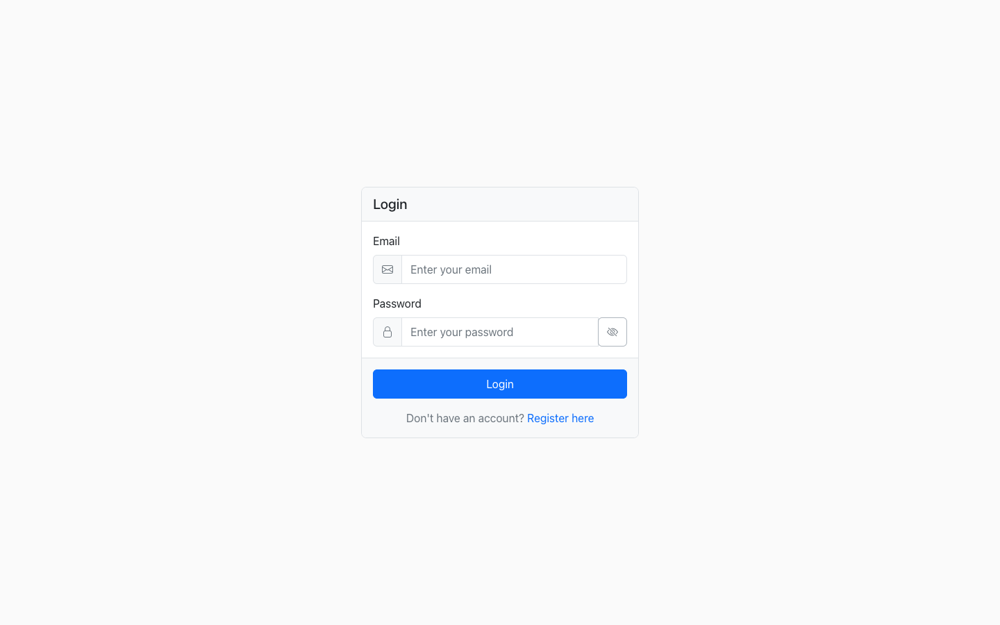
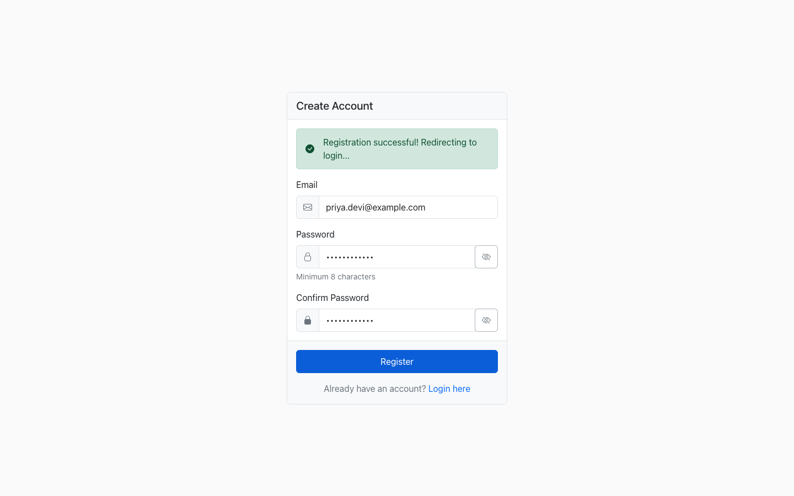
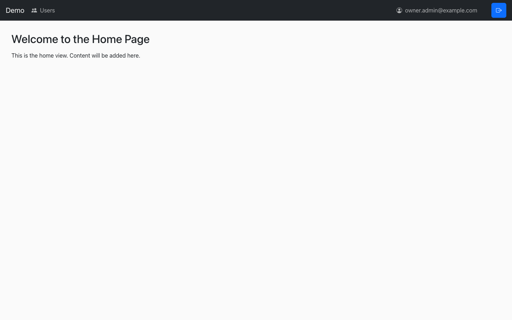
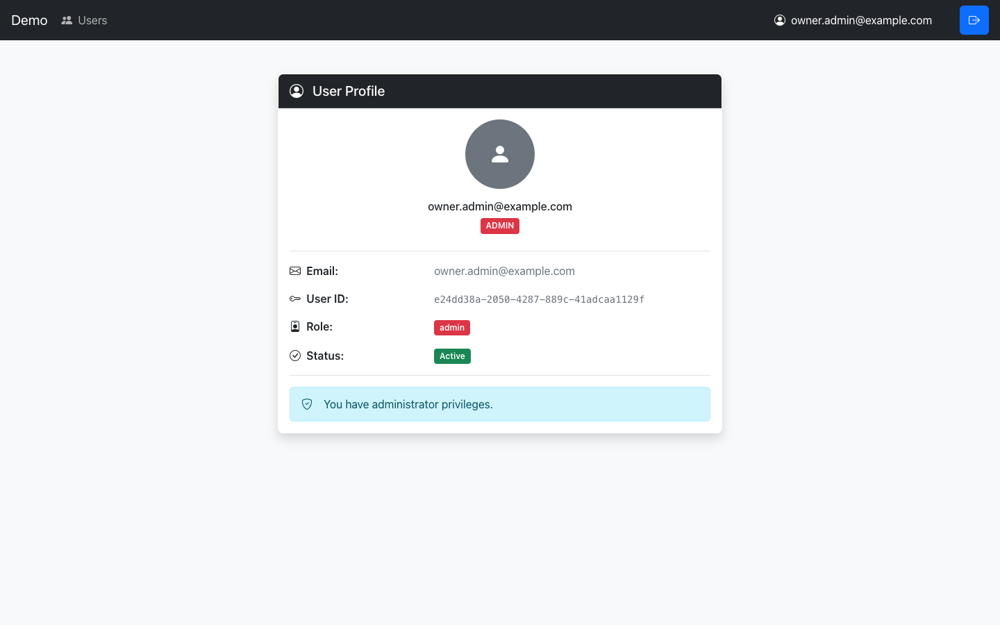
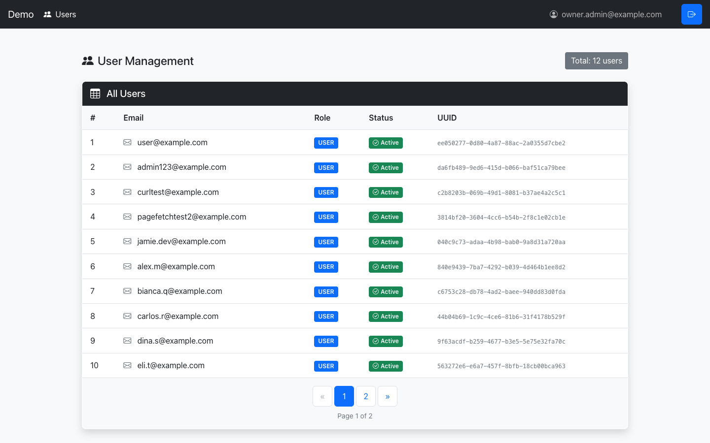

# Frontend

Angular 21 single-page app for the demo FastAPI backend. It covers registration, login, a
protected home and profile view, and an admin panel for managing users. The app talks to the
backend over REST at `${backendUrl}/api/v1` (see `src/environments/environment.ts`, which points
at `http://localhost:8000` for local development).

## Routes

| Path | Component | Guards |
| --- | --- | --- |
| `/` | redirects to `/home` | - |
| `/login` | `LoginViewComponent` | - |
| `/register` | `RegistrationViewComponent` | - |
| `/home` | `HomeViewComponent` | `authGuard` |
| `/profile` | `ProfileViewComponent` | `authGuard` |
| `/admin` | `AdminViewComponent` | `authGuard`, `adminGuard` |
| `**` | redirects to `/home` | - |

`authGuard` sends anyone without a token to `/login`. `adminGuard` waits for the `/users/me`
response and sends non-admins to `/home` (and anyone whose token no longer validates to
`/login`). Both are defined in `src/app/guards/`.

### Login



### Registration



### Home



### Profile



### Admin



## Services

All in `src/app/services/`:

- `api-service` - thin wrapper around `HttpClient`, builds `/api/v1` URLs and centralizes error handling for GET/POST/PUT/DELETE calls.
- `auth-service` - login, register, logout; owns the stored token and exposes an `isAuthenticated` signal.
- `local-storage-service` - reactive `localStorage` access built on Angular signals, used by `auth-service` to persist the token.
- `signalizer-service` - turns an `api-service` call into a set of signals (`isLoading`, `data`, `error`) so views don't hand-roll subscription state.
- `user-info-service` - fetches and caches `/users/me`; the admin guard, header, and profile view share one request instead of firing three.
- `user-management-service` - paginated user listing for the admin view, built on `signalizer-service`.

## Auth flow

Login calls `POST /auth/login`, and `auth-service` stores the returned token through
`local-storage-service`. `src/app/interceptors/auth.interceptor.ts` attaches that token as a
`Bearer` header to every outgoing request except `/auth/login` and `/auth/register` (those carry
credentials in the body, and a 401 from them means "wrong password," not "session expired"). A
401 on any other request logs the user out and the next guarded navigation bounces to `/login`.

The guards and the interceptor are a UX layer, not the security boundary. A route guard decides
what Angular renders and does nothing to stop a direct API call. The real authorization check is
`AuthMiddleware` on the backend, which validates the token and checks role against the
configured `path_access` rules for every request regardless of what the frontend router allows.

## Design system

`src/app/design-system/` holds every color, spacing value, and pattern class the views use (see
its own [README](src/app/design-system/README.md) for the full breakdown). Views never set a
color or size directly, they only reference `ds-*` pattern classes, so the whole look of the app
changes by editing the one token file, `tokens/_tokens.scss`.

## Local setup

The frontend needs the backend running with CORS open for `http://localhost:4200`, which means
the dev profile (`backend-dev`), not the plain `backend` service: the production image loads
`prod_config.yaml`, which doesn't set `api.origins`, so browser requests from the dev server get
blocked. From the repo root, with a `.env` holding `POSTGRES_USER`, `POSTGRES_PASSWORD`,
`POSTGRES_DB`, and `JWT_SECRET_KEY`:

```bash
docker compose --profile dev up -d database backend-dev
docker compose exec backend-dev alembic upgrade head
```

Then, from `frontend/`:

```bash
npm install
npm start
```

`npm start` runs `ng serve` on `http://localhost:4200`. Confirm the backend is actually up first
with `curl -s localhost:8000/health`.

## Running tests

```bash
npm test -- --no-watch
```

Plain `npm test` opens Vitest in watch mode, which won't exit on its own in a script or CI job.
`--run` is not a recognized flag for this project's Angular builder; use `--no-watch` instead.

## Building

```bash
npm run build
```

Compiles the app and writes the output to `dist/`.
